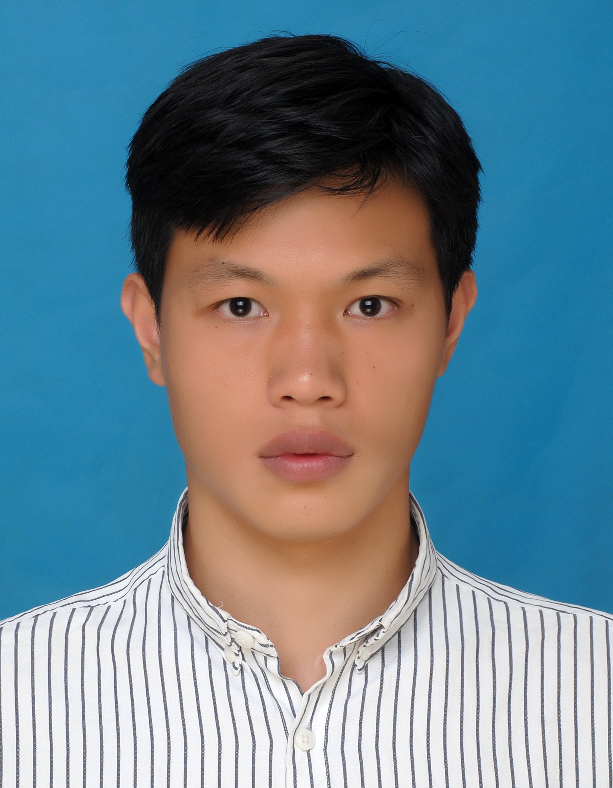

<!-- 
  This style block defines the A4 page effect.
  It's placed here to be self-contained within this file.
-->

<!-- This div wraps all content and applies the .a4-page style -->

  <!-- 
    This section uses HTML to create a two-column layout for the profile.
    - Left column: Profile picture.
    - Right column: Name, title, and contact information.
  -->
  

    
    

      <h2 style="margin-top: 0;">Yuncheng Liu (刘云程)</h2>
      

        Postdoctoral Scholar 
        <a href="https://ise.usc.edu/">Daniel J. Epstein Department of Industrial & Systems Engineering</a> 
        <a href="https://www.usc.edu/">University of Southern California</a>
      

      

        <strong>Office:</strong> OHE 340 
        <strong>Email:</strong> tianlai.cs (at) gmail.com; laitian (at) usc.edu
      

    

  

  ## About Me

  I am a Postdoctoral Scholar at ISE of USC Viterbi working with Prof. [Johannes O. Royset](https://sites.google.com/a/nps.edu/royset/). Before relocating to Los Angeles, I spent four wonderful years in Hong Kong and received my Ph.D. from [The Chinese University of Hong Kong (CUHK)](https://www.cuhk.edu.hk/english/index.html), where I was advised by Prof. [Anthony Man-Cho So](https://www.se.cuhk.edu.hk/people/anthony-man-cho-so/).

  My research interests lie in the interface between mathematical optimization and computer science, with a particular emphasis on applications in modern machine learning. Recently, I have been especially focused on the computational and theoretical aspects of various **approximation techniques** in nonsmooth optimization and variational analysis.

  ## What's New?
  - Honored and grateful to share that our work received the **Best Paper Prize** for Young Researchers at [ICCOPT 2025](https://iccopt2025.gerad.ca/)!

  ## Selected Recent Works [[Google Scholar]](URL_TO_GOOGLE_SCHOLAR_PROFILE)

  - **Approximating Rockafellians Mitigate Distributional Perturbations** \
    L. Tian, J. O. Royset \
    *Preprint, 2025.* \
    [[arXiv]](URL_TO_ARXIV_PAPER_1)

  - **Testing Approximate Stationarity Concepts for Piecewise Affine Functions** \
    L. Tian, A. M.-C. So \
    *Preprint.* \
    [[arXiv]](URL_TO_ARXIV_PAPER_2)

 <!-- This closes the .a4-page wrapper -->
